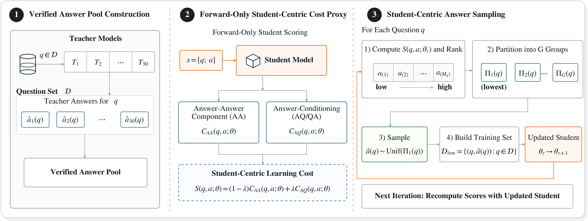

<h1 align="center">Student Distillation Data Selection</h1>

<p align="center">
  <strong>Student-centric teacher answer selection for supervised distillation</strong>
</p>

<div align="center">

[](https://www.python.org/downloads/)
[](LICENSE)
[](pyproject.toml)
[](#overview)

</div>

## Overview

This repository provides a clean public implementation of Student-Centric
Answer Selection (SCAS). Given several teacher-generated answers for the same
prompt, SCAS scores each candidate with respect to the current student model,
selects lower-cost supervision, and exports data that can be used directly for
supervised fine-tuning.

The release includes the method pipeline around data selection, training, and
evaluation, while leaving benchmark-specific large assets and generated
artifacts outside the repository.

<div align="center">
  
</div>

## Key Features

| Module | Entry Point | Purpose |
|---|---|---|
| Candidate scoring | [`scas.scoring.model_candidates`](scas/scoring/model_candidates.py) | Score teacher answers with the current student model. |
| Demo scoring | [`scas.scoring.score_demo_candidates`](scas/scoring/score_demo_candidates.py) | Exercise the pipeline without GPU or model dependencies. |
| Data selection | [`scas.selection.group_by_score`](scas/selection/group_by_score.py) | Rank candidates and export selected SFT data. |
| SFT training | [`scas.training.llamafactory`](scas/training/llamafactory.py) | Build or run LLaMA-Factory/DeepSpeed SFT commands. |
| Response generation | [`scas.generation.generate_responses`](scas/generation/generate_responses.py) | Generate validation responses through an OpenAI-compatible endpoint or local vLLM. |
| Math evaluation | [`scas.evaluation.judge_math`](scas/evaluation/judge_math.py) | Judge generated answers with rules or an LLM judge. |

## Installation

Install the base package for JSONL processing, demo scoring, grouping,
training dry-runs, and rule-based evaluation:

```bash
python -m venv .venv
source .venv/bin/activate
pip install -e .
```

Install optional dependencies as needed:

```bash
# Student-model SCAS scoring
pip install -e ".[model]"

# OpenAI-compatible generation, LLM judging, and vLLM helpers
pip install -e ".[runtime]"

# Full local setup
pip install -e ".[full]"
```

LLaMA-Factory itself is not vendored. Pass the local paths to
`LLAMAFACTORY_TRAIN` and `DEEPSPEED_CONFIG` when launching SFT.

## Quick Start

Run the small public demo:

```bash
bash examples/run_demo.sh
```

This scores three toy teacher files, groups candidates, and writes selected
SFT-ready data under:

```text
outputs/demo/
├── scored/
│   ├── teacher_brief_scas_scores.jsonl
│   ├── teacher_direct_scas_scores.jsonl
│   └── teacher_verbose_scas_scores.jsonl
└── grouped/scas_score/3_groups/
    ├── group_1.jsonl
    ├── group_2.jsonl
    ├── group_3.jsonl
    ├── selected_group_1.jsonl
    ├── dataset_info.json
    └── manifest.json
```

Run a no-GPU training dry-run on the selected demo data:

```bash
DATASET_DIR=outputs/demo/grouped/scas_score/3_groups \
DATASET_NAME=selected_group_1 \
MODEL_NAME_OR_PATH=/path/to/base-student \
OUTPUT_DIR=outputs/demo/train_dry_run \
DRY_RUN=1 \
bash scripts/train_sft.sh
```

Run rule-based evaluation on the toy generated answers:

```bash
MODEL_OUTPUT_JSONL=examples/validation/toy_generations.jsonl \
EVAL_OUTPUT_JSONL=outputs/demo/eval_math.jsonl \
bash scripts/evaluate_math.sh
```

## Full Workflow

### Step 1: Prepare Candidate Answers

Place one JSONL file per teacher in a candidate directory:

```text
candidate_answers/
├── teacher_a_student_train.jsonl
├── teacher_b_student_train.jsonl
└── teacher_c_student_train.jsonl
```

Each row should include an id shared across teachers, a prompt, and a candidate
answer:

```json
{"id": "item-1", "instruction": "Question text", "teacher_output": "Answer text"}
```

### Step 2: Score Teacher Candidates

Use the real SCAS scorer with the current student model:

```bash
python -m scas.scoring.model_candidates \
  --student-model /path/to/student-checkpoint \
  --candidate-dir candidate_answers \
  --output-dir outputs/scored \
  --lambda-scas 0.5
```

By default, the scorer uses the final `model.layers.*.mlp.up_proj` layer for
Llama/Qwen-style decoder models. For other architectures, pass
`--target-layer`.

### Step 3: Select Supervision

Group candidate answers by ascending score and select the lowest-cost group:

```bash
python -m scas.selection.group_by_score \
  --input-dir outputs/scored \
  --output-dir outputs/grouped \
  --score-key scas_score \
  --num-groups 5 \
  --selected-group 1
```

The selected file is:

```text
outputs/grouped/scas_score/5_groups/selected_group_1.jsonl
```

### Step 4: Train the Student

Launch SFT through LLaMA-Factory:

```bash
DATASET_DIR=outputs/grouped/scas_score/5_groups \
DATASET_NAME=selected_group_1 \
MODEL_NAME_OR_PATH=/path/to/base-student \
OUTPUT_DIR=outputs/train/student_scas \
LLAMAFACTORY_TRAIN=/path/to/LLaMA-Factory/src/train.py \
DEEPSPEED_CONFIG=/path/to/LLaMA-Factory/examples/deepspeed/ds_z3_config.json \
NUM_GPUS=4 \
bash scripts/train_sft.sh
```

Set `DRY_RUN=1` to print the exact DeepSpeed command without starting training.

### Step 5: Generate and Evaluate

Generate validation responses with an existing OpenAI-compatible endpoint:

```bash
INPUT_JSONL=data/validation.jsonl \
OUTPUT_JSONL=outputs/eval/generated.jsonl \
API_BASE=http://127.0.0.1:8000/v1 \
MODEL_NAME=student-scas \
bash scripts/generate_responses.sh
```

Evaluate generated math answers:

```bash
MODEL_OUTPUT_JSONL=outputs/eval/generated.jsonl \
EVAL_OUTPUT_JSONL=outputs/eval/judged.jsonl \
REFERENCE_FIELD=reference_answer \
MODEL_OUTPUT_FIELD=model_output \
bash scripts/evaluate_math.sh
```

For local vLLM serving, set `MODEL_PATH=/path/to/checkpoint` and
`START_VLLM=1` in `scripts/generate_responses.sh`. For LLM-based judging, set
`EVAL_METHOD=llm`, `JUDGE_API_BASE`, and `JUDGE_MODEL`.

## Output Structure

```text
outputs/
├── scored/                         # One *_scas_scores.jsonl file per teacher
├── grouped/scas_score/5_groups/    # SFT-ready selected data
├── train/student_scas/             # Fine-tuned student checkpoint
└── eval/
    ├── generated.jsonl             # Student generations
    └── judged.jsonl                # Per-row correctness labels
```

## Project Structure

```text
student_distillation_data_selection/
├── scas/
│   ├── scoring/                    # SCAS metric and candidate scoring
│   ├── selection/                  # Group and min-score selection
│   ├── training/                   # LLaMA-Factory command builder
│   ├── generation/                 # OpenAI-compatible generation
│   ├── evaluation/                 # Rule/LLM judging and filtering
│   ├── runtime/                    # vLLM server helpers
│   └── io.py                       # JSONL utilities
├── scripts/                        # Public workflow entry points
├── examples/                       # Tiny candidate and evaluation fixtures
├── docs/                           # Schemas and train/eval guide
├── assets/                         # Workflow image
└── tests/                          # Public smoke tests
```

## Documentation

- [Data format](docs/data_format.md)
- [Training and evaluation](docs/training_and_evaluation.md)
- [Example data](examples/README.md)

## Checks

```bash
make check
```

## License

This project is released under the [MIT License](LICENSE).
